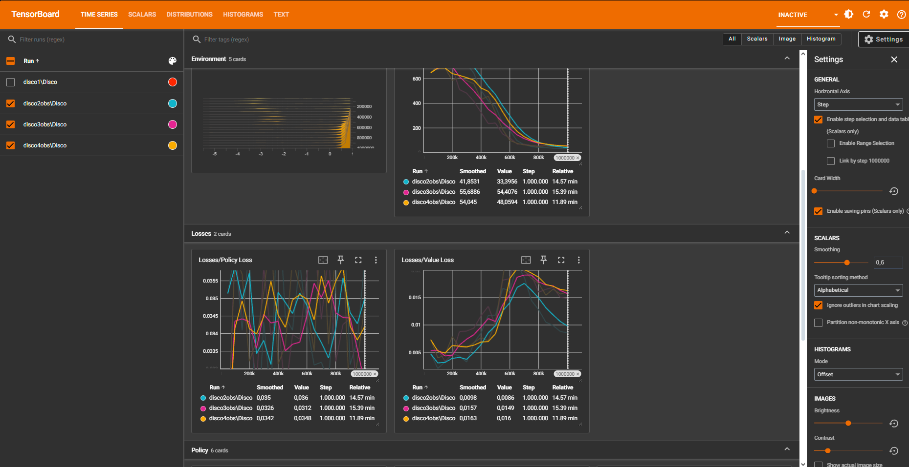
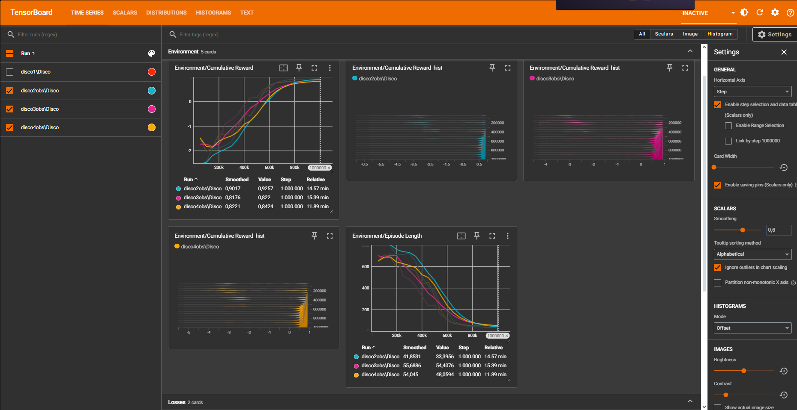

# 🧠 Autonomous Agent Navigation via Reinforcement Learning (PPO)

A Deep Reinforcement Learning (DRL) proof of concept developed with **Unity ML-Agents Toolkit** and **Python**. An autonomous agent is trained using the **Proximal Policy Optimization (PPO)** algorithm to navigate dynamic obstacle environments, optimize trajectories, and reach targets safely.

---

## 🛠️ Tech Stack & Frameworks

* **Environment & Simulation:** Unity 3D (C#)
* **AI Framework:** Unity ML-Agents Toolkit (v2.0+)
* **Machine Learning Library:** PyTorch / Python 3.9+
* **Algorithm:** Proximal Policy Optimization (PPO)
* **Telemetry & Metrics:** TensorBoard

---

## 📐 Architecture & Reward Shaping

The agent interacts with the environment using continuous vector observations and continuous action spaces.

* **Vector Observations:** Agent position, velocity, raycast distance measurements to obstacles, and direction vector toward the target.
* **Reward Function Architecture (R):**
  * +1.0 for successfully reaching the target goal.
  * -0.001 per step time penalty to encourage optimal pathfinding.
  * -0.5 heavy collision penalty when contacting obstacles or walls.

---

## 📊 Telemetry & Performance Analysis (TensorBoard)

The training progress was tracked over **1,000,000 environment steps**. The telemetry graphs illustrate clear convergence and policy optimization:

| Metric | Initial Value | Final Value | Interpretation |
| :--- | :--- | :--- | :--- |
| **Cumulative Reward** | ~ -2.0 | **+0.92** | Continuous improvement in goal acquisition and collision avoidance. |
| **Episode Length** | ~ 650 steps | **<55 steps** | Agent learned the shortest and fastest trajectory toward the goal. |
| **Value / Policy Loss** | Unstable | **Stabilized** | PPO policy convergence without gradient explosion or mode collapse. |

### 📈 Convergence Graphs

*Figure 1: Cumulative Reward trajectory reaching optimization threshold around 800k steps.*

*Figure 2: Drastic reduction in episode length as optimal navigation strategy is mastered.*

---

## 🚀 How to Run & Inference

### 1. Requirements
* Unity 2022.3 LTS or higher
* Python 3.9+
* Anaconda or venv virtual environment

### 2. Environment Setup
git clone https://github.com/MarketablePlushiee/Unity-ML-Agents-PPO.git
cd Unity-ML-Agents-PPO
pip install mlagents

### 3. Training
To start training the agent with the custom YAML configuration:
mlagents-learn config/OBS.yaml --run-id=PPO_Agent_Run_01

---

## 👨‍💻 Developer Contact

* **Developer:** Ivan Latrille Brito (ivan.latrille1@gmail.com)
* **GitHub:** @MarketablePlushiee
* **Portfolio:** marketableplushiee.github.io/Portafolio